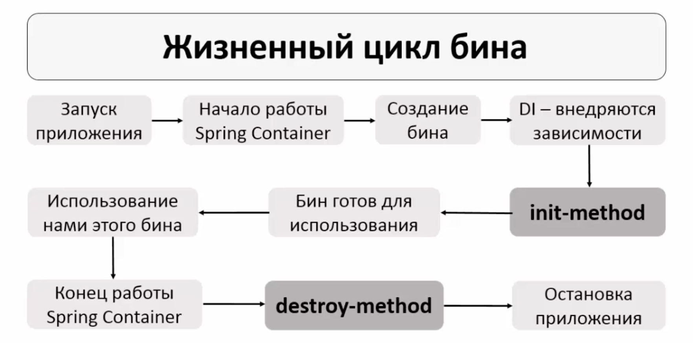

# Конфигурирование Spring Framework

```plaintext
    В данном файле собрана информация про конфигурирование Spring Framework
```

- [Конфигурирование Spring Framework](#конфигурирование-spring-framework)
  - [Spring Bean](#spring-bean)
    - [Видимость бинов в Spring](#видимость-бинов-в-spring)
      - [Singleton (Область видимости по умолчанию)](#singleton-область-видимости-по-умолчанию)
      - [Prototype](#prototype)
      - [Request (для веб-приложений)](#request-для-веб-приложений)
      - [Session (для веб-приложений)](#session-для-веб-приложений)
      - [Global Session (для портлетов)](#global-session-для-портлетов)
      - [Application (для веб-приложений)](#application-для-веб-приложений)
      - [WebSocket (для WebSocket-приложений)](#websocket-для-websocket-приложений)
  - [Конфигурация c помощью XML файла](#конфигурация-c-помощью-xml-файла)
    - [Основные правила написания `applicationContext.xml`](#основные-правила-написания-applicationcontextxml)
      - [Основная структура файла](#основная-структура-файла)
      - [Определение бинов](#определение-бинов)
      - [Инъекция зависимостей](#инъекция-зависимостей)
      - [Использование внешних ресурсов (.properties)](#использование-внешних-ресурсов-properties)
      - [Включение дополнительных модулей](#включение-дополнительных-модулей)
      - [Использование профилей](#использование-профилей)
      - [Импорт других конфигурационных файлов](#импорт-других-конфигурационных-файлов)
    - [Загрузка бинов из `applicationContext.xml`](#загрузка-бинов-из-applicationcontextxml)
  - [Конфигурация c помощью Аннотиций и XML файла](#конфигурация-c-помощью-аннотиций-и-xml-файла)
    - [Настройка XML файла](#настройка-xml-файла)
    - [Настройка классов через аннотации](#настройка-классов-через-аннотации)
      - [@Component](#component)
      - [@Autowired](#autowired)
        - [Использование для Конструктора](#использование-для-конструктора)
        - [Использование для Сеттeра](#использование-для-сеттeра)
        - [Использование для Полей](#использование-для-полей)
      - [@Qualifier](#qualifier)
      - [@Value](#value)
        - [Инъекция hardcoded значений](#инъекция-hardcoded-значений)
        - [Инъекция значений из файла свойств (properties)](#инъекция-значений-из-файла-свойств-properties)
        - [Инъекция системных переменных и переменных окружения](#инъекция-системных-переменных-и-переменных-окружения)
        - [Инъекция значений с использованием SpEL (Spring Expression Language)](#инъекция-значений-с-использованием-spel-spring-expression-language)
        - [Использование `@Value` с дефолтными значениями](#использование-value-с-дефолтными-значениями)
      - [@Scope](#scope)
      - [@PostConstruct, @PreDestroy](#postconstruct-predestroy)
  - [Конфигурация через Java код (Java-based)](#конфигурация-через-java-код-java-based)
    - [@Configuration](#configuration)
    - [@Bean](#bean)
    - [Инициализация компонентов](#инициализация-компонентов)
      - [@PostConstruct](#postconstruct)
      - [@Bean с инициализационным методом (initMethod)](#bean-с-инициализационным-методом-initmethod)
      - [Создание бина инициализации](#создание-бина-инициализации)
    - [@ComponentScan](#componentscan)
    - [@Import](#import)
      - [Пример использования Import](#пример-использования-import)
    - [@PropertySource](#propertysource)
      - [Пример использования PropertySource](#пример-использования-propertysource)
    - [@ConditionalOnProperty](#conditionalonproperty)
    - [@Enable... аннотации](#enable-аннотации)
      - [Пример использования  Enable... аннотаций](#пример-использования--enable-аннотаций)
    - [Использование бинов из классов @Component в @Configuration](#использование-бинов-из-классов-component-в-configuration)
      - [Использование аннотации @Autowired (Не рекомендуется)](#использование-аннотации-autowired-не-рекомендуется)
      - [Использование метода @Bean в @Configuration](#использование-метода-bean-в-configuration)
      - [Использование ApplicationContext](#использование-applicationcontext)
    - [Использование Java-конфигурации](#использование-java-конфигурации)

## Spring Bean

`Spring Bean` (или просто bean) - это объект, который создается и управляется Spring Container

Жизненный цикл бинов

### Видимость бинов в Spring

В Spring Framework видимость бинов управляется с помощью **области видимости** (scope), которая определяет жизненный цикл и доступность бинов внутри Spring IoC контейнера. В зависимости от области видимости, бин может быть либо один на всё приложение, либо создаваться заново при каждом запросе, либо иметь другую область видимости.

**Основные области видимости бинов в Spring:**

#### Singleton (Область видимости по умолчанию)

- **Особенности**:
  - Такой бин создается сразу после прочтения файла конфигурации, даже если он не используется в коде
  - Создается один раз на всё приложение и существует в одном экземпляре
  - Подходит для stateless объектов (объектов, состояние которых нам менять не приходится)
- **Применение**: Это наиболее распространенная область видимости, которая подходит для компонентов, не имеющих состояния, или когда нужно централизованное управление состоянием.

**Плюсы**:

- Экономия ресурсов, так как создается только один экземпляр бина.
- Удобно для сервисов без состояния.

**Минусы**:

- В случае наличия состояния, это состояние может быть разделено между разными частями приложения, что может привести к неожиданным результатам.

#### Prototype

- **Особенности**:
  - Такой бин создается только после обращения к Spring Container-у с помощью метода getBean
  - Для каждого обращения создается новый бин
  - Подходит для stateful объектов (объектов, которые могут иметь состояние)
  - Не вызывает метод destroy, который описан в `destroy-method`, ресурсы необходимо освобождать самостоятельно
- **Применение**: Используется для бинов, которые содержат состояние и не должны разделяться между разными частями приложения.

**Плюсы**:

- Подходит для объектов со состоянием, которые должны быть уникальными для каждого использования.

**Минусы**:

- Увеличенное потребление ресурсов, так как создается много экземпляров одного и того же бина.
- Усложненный жизненный цикл управления, так как контейнер Spring не управляет уничтожением таких бинов.

#### Request (для веб-приложений)

- **Описание**: Бин с областью видимости `request` создается заново для каждого HTTP-запроса. Это означает, что бин живет в рамках одного запроса и уничтожается после завершения обработки запроса.
- **Применение**: Используется для объектов, которые имеют смысл только в контексте одного HTTP-запроса, например, для данных формы или временных объектов.

**Плюсы**:

- Изолированность состояния для каждого HTTP-запроса.
- Подходит для использования в веб-приложениях.

**Минусы**:

- Доступен только в контексте веб-приложения.
- Создание большого количества таких бинов может потребовать значительных ресурсов.

#### Session (для веб-приложений)

- **Описание**: Бин с областью видимости `session` создается один раз для каждого HTTP-сеанса пользователя и доступен на протяжении всей сессии.
- **Применение**: Используется для данных, которые должны сохраняться между запросами в рамках одной сессии пользователя, например, для данных авторизации или корзины покупок.

**Плюсы**:

- Подходит для хранения данных сессии пользователя.
- Позволяет сохранить состояние между запросами одного пользователя.

**Минусы**:

- Доступен только в контексте веб-приложения.
- Необходимо управление временем жизни сессии.

#### Global Session (для портлетов)

- **Описание**: Эта область видимости похожа на `session`, но предназначена для глобальных сессий в портлетах. Используется в приложениях на базе Java EE, где могут использоваться глобальные сессии.
- **Применение**: Редко используется, в основном в контексте портлетных приложений.

#### Application (для веб-приложений)

- **Описание**: Бин с областью видимости `application` живет в течение всего жизненного цикла веб-приложения. Это один экземпляр бина для всего приложения (аналогично `singleton`, но в контексте веб-приложения).
- **Применение**: Используется для объектов, которые должны быть доступны во всех запросах и сессиях в пределах одного приложения.

#### WebSocket (для WebSocket-приложений)

- **Описание**: Бин с областью видимости `websocket` создается на время существования WebSocket-соединения.
- **Применение**: Используется для объектов, которые должны существовать в контексте одного WebSocket-соединения.

## Конфигурация c помощью XML файла

Конфигурационный файл `applicationContext.xml` в Spring — это один из способов конфигурирования приложения. Этот XML-файл используется для определения бинов и их зависимостей, настройки компонентов Spring и интеграции различных модулей. Несмотря на то, что в современных проектах все чаще используют аннотации и Java-based конфигурации, понимание `applicationContext.xml` все еще полезно, особенно при работе с более старыми проектами или в специфических случаях.

### Основные правила написания `applicationContext.xml`

#### Основная структура файла

Конфигурационный файл `applicationContext.xml` начинается с определения корневого элемента `<beans>` и включения пространства имен (namespaces), которые указывают на используемые схемы XML:

```xml
<?xml version="1.0" encoding="UTF-8"?>
<beans xmlns="http://www.springframework.org/schema/beans"
       xmlns:xsi="http://www.w3.org/2001/XMLSchema-instance"
       xmlns:context="http://www.springframework.org/schema/context"
       xsi:schemaLocation="http://www.springframework.org/schema/beans
        http://www.springframework.org/schema/beans/spring-beans.xsd
        http://www.springframework.org/schema/context
        http://www.springframework.org/schema/context/spring-context.xsd">
    <!-- Определения бинов и конфигурация -->
</beans>
```

Здесь:

- **`xmlns="http://www.springframework.org/schema/beans"`**: Пространство имен для определения бинов.
- **`xmlns:xsi="http://www.w3.org/2001/XMLSchema-instance"`**: Пространство имен для поддержки схемы XML.
- **`xsi:schemaLocation="http://www.springframework.org/schema/beans http://www.springframework.org/schema/beans/spring-beans.xsd"`**: Определение местоположения схемы, которая будет использована для проверки правильности XML.

#### Определение бинов

Для определения бинов используется элемент `<bean>`. Основные атрибуты, которые часто используются:

- **`id`**: Уникальный идентификатор бина в контейнере Spring.
- **`class`**: Полностью квалифицированное имя класса, который будет использован для создания бина.
- **`scope`**: Определяет область видимости бина (`singleton`, `prototype`, `request`, `session`, `globalSession` и т.д.).
- **`init-method`**: Определяет метод, который вызывается после инициализации объекта (модификатор доступа у метода может быть любым). У метода не должно быть параметров
- **`destroy-method`**: Определяет метод, который вызывается после context.close() (модификатор доступа у метода может быть любым). Не вызывается у объектов со scope="prototype". У метода не должно быть параметров

Пример определения бина:

```xml
<bean id="myBeanId"
    class="com.example.MyClass"
    scope="singleton"
    init-method="myInitMethodName"
    destroy-method="myDestroyMethodName">
    <!-- Дополнительные настройки бина -->
</bean>
```

#### Инъекция зависимостей

Spring поддерживает несколько способов инъекции зависимостей через XML-конфигурацию:

- **Конструкторная инъекция**:

  Используйте элемент `<constructor-arg>` для передачи аргументов в конструктор:

  ```xml
  <bean id="myBean" class="com.example.MyClass">
      <constructor-arg value="SomeValue"/> <!-- Передача простого значения -->
      <constructor-arg ref="anotherBeanID"/> <!--  Передача ссылки на другой бин -->
  </bean>
  ```

- **Сеттерная инъекция**:

  Используйте элемент `<property>` для инъекции через сеттеры:

  ```xml
  <bean id="myBeanID" class="com.example.MyClass">
      <property name="propertyName" value="SomeValue"/> <!-- Установка в поле propertyName значения SomeValue -->
      <property name="anotherProperty" ref="anotherBeanID"/> <!-- Установка в поле anotherProperty другого бина -->
      <!-- Для работы обязательно должны быть сеттеры  setPropertyName и setAnotherProperty -->
  </bean>
  ```

#### Использование внешних ресурсов (.properties)

Spring позволяет подключать внешние ресурсы (например, файлы свойств) с помощью элемента `<context:property-placeholder>`:
**`Подключение файла свойств необходимо`**, чтобы избежать прямого указания значений в конфигуарционном файле.

```xml
<context:property-placeholder location="classpath:application.properties"/> <!-- Подключение файла свойст application.properties -->
<bean id="myBean" class="com.example.MyClass">
    <property name="propertyName" value="${property.key}"/> <!-- Использование значения из файла свойств-->
</bean>
```

#### Включение дополнительных модулей

Вы можете включить другие модули Spring через пространство имен, добавив их в корневой элемент `<beans>`. Например:

- **`context`**: Для работы с аннотациями и сканирования компонентов.
- **`aop`**: Для работы с аспектно-ориентированным программированием.
- **`tx`**: Для управления транзакциями.

Пример:

```xml
<beans xmlns="http://www.springframework.org/schema/beans"
       xmlns:xsi="http://www.w3.org/2001/XMLSchema-instance"
       xmlns:context="http://www.springframework.org/schema/context"
       xsi:schemaLocation="http://www.springframework.org/schema/beans
                           http://www.springframework.org/schema/beans/spring-beans.xsd
                           http://www.springframework.org/schema/context
                           http://www.springframework.org/schema/context/spring-context.xsd">

    <context:component-scan base-package="com.example"/>
</beans>
```

#### Использование профилей

Для разделения конфигураций на разные среды (например, `dev`, `prod`) используется элемент `<beans>` с атрибутом `profile`. Это позволяет определять разные наборы бинов для различных профилей.

```xml
<beans profile="dev">
    <bean id="dataSource" class="com.example.DevDataSource"/>
</beans>

<beans profile="prod">
    <bean id="dataSource" class="com.example.ProdDataSource"/>
</beans>
```

Профиль можно активировать через параметры JVM или конфигурационные файлы.

#### Импорт других конфигурационных файлов

Вы можете импортировать другие XML-конфигурационные файлы с помощью элемента `<import>`:

```xml
<import resource="classpath:anotherContext.xml"/>
```

Это помогает разбивать конфигурацию на логические части.

### Загрузка бинов из `applicationContext.xml`

ApplicationContext представляет собой Spring Container. Поэтому для получения бина из Spring Container нужно создать ApplicationContext

```java
    ClassPathXmlApplicationContext context = new ClassPathXmlApplicationContext("applicationContext.xml", "applicationContext2.xml"); // Загрузка контекста из XML-конфигурации (можно указать несколько файлов конфигурации)
    MyClass myBean = context.getBean("myBeanId", MyClass.class); // Загрузка бина
    context.close(); // Закрываем контекст 
```

## Конфигурация c помощью Аннотиций и XML файла

Spring позволяет использовать аннотации и XML-конфигурацию вместе. Это может быть полезно, если часть конфигурации нужно оставить в XML (например, конфигурация инфраструктуры), а часть — перенести на уровень кода с помощью аннотаций.

Конфигурация с помощью аннотаций более короткий и быстрый способ, чем конфигурация с помощью XML файла.

### Настройка XML файла

```xml
<beans xmlns="http://www.springframework.org/schema/beans"
       xmlns:xsi="http://www.w3.org/2001/XMLSchema-instance"
       xmlns:context="http://www.springframework.org/schema/context"
       xsi:schemaLocation="http://www.springframework.org/schema/beans
                           http://www.springframework.org/schema/beans/spring-beans.xsd
                           http://www.springframework.org/schema/context
                           http://www.springframework.org/schema/context/spring-context.xsd">

    <context:component-scan base-package="com.example"/><!-- Указание пакета для сканирования com.example, сканирование в поисках аннотаций будет проходить также в подпакетах com.example -->
</beans>
```

### Настройка классов через аннотации

#### @Component

`@Component` — это одна из стереотипных аннотаций Spring, которая используется для автоматической регистрации классов в контексте Spring как бинов. Когда класс аннотирован @Component, Spring автоматически обнаруживает и регистрирует его как бин, который может быть затем использован в других частях приложения.

`component-scan` ищет все классы, которые содержат `@Component("beanID")`:

```java
    @Component("catBean") // Лучше исопльзовать свой ID, который придумали мы, чем дефолтный
    public class Cat {...}

    @Component // Если к аннотации не прописать bean id, то бину будет назначен дефолтный id. Дефолтный bean id получается из имени класса, заменяя его первую заглавную букву на прописную. В нашем случае будет bean id = dog
    public class Dog {...}

    @Component // Если хотя бы 2 первые буквы заглавные, то bean id будет равен имени класса. В нашем случае будет bean id = SQLTest
    public class SQLTest {...}
```

#### @Autowired

`@Autowired` — это аннотация Spring, которая позволяет автоматически инъектировать зависимости в бины. Spring использует эту аннотацию для поиска и автоматического связывания нужных зависимостей, будь то через конструктор, поле или сеттер.

Где можно исопльзовать `@Autowired`:

- Конструктор
- Сеттер
- Поле

Процесс внедрения завимости при исопльзовании `@Autowired`:

1. Сканирование пакета в поисках классов с аннотацией `@Component`
2. При наличии аннотации `@Autowired` начинается поиск подходящего по типу бина
3. Далее ситуация развивается по одному из сценариев:
    - Если находится 1 подходящий бин, просходит внедрение зависимости;
    - Если подходящих по типу бинов нет, то выбрасывается исключение;
    - Если подходящий по типу бинов больше одного, тоже выбрасывается исключение. Для решения данной проблемы необходимо исопльзовать аннотацию [@Qualifier](#qualifier)

##### Использование для Конструктора

```java
    @Component("friendBean")
    public class Friend {...}

    @Component("personBean")
    class Person {
        Friend friend;

        @Autowired // Данная аннотация увидит, что существует класс Friend, который мы отметили @Component, поэтому Spring Container автоматически подставит зависимость friendBean в personBean (работатет если в Spring Container существует всего один бин с типом Friend)
        Person(Friend friend) {
            this.friend = friend;
        }

        /* @Autowired работает аналогично и для сеттеров и для полей */
    }
```

##### Использование для Сеттeра

```java
    @Component("friendBean")
    public class Friend {...}

    @Component("personBean")
    class Person {
        Friend friend;

        @Autowired // Данная аннотация увидит, что существует класс Friend, который мы отметили @Component, поэтому Spring Container автоматически выполнит метод setFriend и подставит зависимость в Person (работатет если в Spring Container существует всего один бин с типом Friend)
        //  * setFriend не обязательно должен иметь такое название, !может быть любое имя!
        void setFriend(Friend friend) {
            this.friend = friend;
        }
        /* @Autowired работает аналогично и для сеттеров и для полей */
 
    }
```

##### Использование для Полей

```java
    @Component("friendBean")
    public class Friend {...}

    @Component("personBean")
    class Person {
        
        @Autowired // Автоматическое внедрение зависимости в поле friend. Поле friend может иметь любой тип доступа
        private Friend friend;
    }
```

#### @Qualifier

Аннотация `@Qualifier` в Spring используется для разрешения неоднозначностей при инъекции зависимостей, когда существует более одного бина одного типа в контексте. В таких ситуациях Spring не может автоматически выбрать, какой именно бин использовать, и возникает конфликт. @Qualifier позволяет указать конкретный бин, который должен быть инъектирован

**Пример исопльзования:**

```java
    @Component("catBean")
    class Cat implements Pet {...}

    @Component("dogBean")
    class Dog implements Pet {...}

    @Component("fishBean")
    class fish implements Pet {...}

    @Component("personBean")
    class Person {
        
        @Autowired
        @Qualifier("dogBean") // В данную позицию будет инъектирован dogBean
        private Pet dog; 
        private Pet cat; 
        private Pet fish;

        @Autowired
        Person(@Qualifier("fishBean") Pet fish) { // Для конструтора @Qualifier указывается для паратеров, а не для самого конструктора.  данную позицию будет инъектирован fishBean
            this.fish = fish;
        }

        @Autowired
        @Qualifier("catBean") // В данную позицию будет инъектирован catBean
        void setCat(Pet cat) {
            this.cat = cat;
        }
    }
```

#### @Value

Аннотация `@Value` в Spring используется для инъекции значений в поля, параметры методов или конструкторов из внешних источников, таких как файлы свойств (properties), системные переменные, переменные окружения или другие источники конфигурационных данных. Это удобный способ параметризовать бины, что делает их более гибкими и адаптируемыми к разным средам.

##### Инъекция hardcoded значений

```java
    @Component("personBean")
    public class Person {
        int age;
        @Value("Bachinin") // Использование @Value к переменной
        String surname;

        Person(@Value("21") int age) { // Использование @Value в конструторе
            this.age = age;
        }
    }
```

##### Инъекция значений из файла свойств (properties)

**`application.properties`**:

```properties
app.name=My Application
app.version=1.0.0
app.description=This is a sample application
```

Указываем в XML файле, что необходимо обработать данный файл:

```xml
    <context:property-placeholder location="classpath:application.properties"/>
```

**Пример инъектирования из файла свойств**:

```java
import org.springframework.beans.factory.annotation.Value;
import org.springframework.stereotype.Component;

@Component
public class AppConfig {

    @Value("${app.name}")
    private String appName;

    @Value("${app.version}")
    private String appVersion;

    @Value("${app.description}")
    private String appDescription;

    public void printConfig() {
        System.out.println("App Name: " + appName);
        System.out.println("App Version: " + appVersion);
        System.out.println("App Description: " + appDescription);
    }
}
```

##### Инъекция системных переменных и переменных окружения

```java
import org.springframework.beans.factory.annotation.Value;
import org.springframework.stereotype.Component;

@Component
public class SystemConfig {

    @Value("${JAVA_HOME}") // Инъектирует значение переменной окружения JAVA_HOME
    private String javaHome;

    @Value("${user.name}") // Инъектирует значение системной переменной user.name
    private String userName;

    public void printSystemConfig() {
        System.out.println("JAVA_HOME: " + javaHome);
        System.out.println("User Name: " + userName);
    }
}
```

##### Инъекция значений с использованием SpEL (Spring Expression Language)

`@Value` поддерживает использование Spring Expression Language (SpEL), что позволяет выполнять более сложные операции при инъекции значений.

Пример:

```java
import org.springframework.beans.factory.annotation.Value;
import org.springframework.stereotype.Component;

@Component
public class SpELExample {

    @Value("#{systemProperties['user.name']}") // Инъектирует значение системной переменной user.name
    private String userName;

    @Value("#{T(java.lang.Math).random() * 100.0}") // Инъектирует случайное значение, умноженное на 100
    private double randomValue;

    @Value("#{2 + 3}") // Инъектирует результат арифметического выражения
    private int simpleCalculation;

    public void printValues() {
        System.out.println("User Name: " + userName);
        System.out.println("Random Value: " + randomValue);
        System.out.println("Simple Calculation (2 + 3): " + simpleCalculation);
    }
}
```

##### Использование `@Value` с дефолтными значениями

Вы можете задать значение по умолчанию, которое будет использовано, если ключ не найден в файле свойств или переменная окружения не установлена:

```java
@Value("${app.timeout:30}") // Eсли `app.timeout` не будет найден в файле свойств, значением по умолчанию будет `30`
private int appTimeout;
```

#### @Scope

Аннотация @Scope в Spring используется для указания [области видимости (scope) бина](#видимость-бинов-в-spring), то есть определения, как и когда бин должен создаваться и сколько экземпляров этого бина должно существовать в Spring-контейнере.

```java
    @Component("personBean")
    @Scope("prototype") // Указание области видимости
    public class Person {...}
```

#### @PostConstruct, @PreDestroy

`@PostConstruct` — это аннотация, которая указывает, что метод должен быть вызван сразу после того, как бин был создан и его зависимости были инъектированы, но до того, как бин будет использован в контексте. Это аналогично методу init() в традиционных JavaBeans.

**Основные моменты**:

- Метод, помеченный аннотацией @PostConstruct, выполняется один раз после создания бина и завершения инъекции его зависимостей.
- Чаще всего используется для инициализации ресурсов, проверки конфигураций, выполнения дополнительных настроек и т.д.
- Метод, помеченный @PostConstruct, не должен принимать никаких параметров и должен возвращать void.

`@PreDestroy` — это аннотация, которая указывает, что метод должен быть вызван перед тем, как бин будет удален из Spring-контейнера. Это аналогично методу destroy() в традиционных JavaBeans.

**Основные моменты**:

- Метод, помеченный аннотацией @PreDestroy, выполняется один раз перед уничтожением бина.  Не вызывается у объектов со scope="prototype".
- Обычно используется для освобождения ресурсов, закрытия соединений или выполнения других завершающих операций.
- Метод, помеченный @PreDestroy, не должен принимать никаких параметров и должен возвращать void.

## Конфигурация через Java код (Java-based)

В Spring Framework можно полностью сконфигурировать приложение с использованием Java-кода, без необходимости в XML-файлах. Такой подход называется **Java-based конфигурацией**. Он предоставляет гибкость и позволяет использовать мощные возможности языка Java для настройки Spring-приложения.

### @Configuration

**`@Configuration`** — это аннотация, которая указывает, что класс является источником конфигурации бинов для Spring-контейнера. Классы, аннотированные `@Configuration`, могут содержать методы, аннотированные `@Bean`, которые будут создавать и настраивать бины.

```java
import org.springframework.context.annotation.Configuration;

@Configuration
public class AppConfig { // AppConfig — это класс конфигурации, который создает бин MyService.

    @Bean
    public MyService myService() {
        return new MyServiceImpl();
    }
}
```

### @Bean

**`@Bean`** используется для обозначения метода, который создает и настраивает бин, управляемый Spring-контейнером. Каждый такой метод возвращает объект, который Spring регистрирует как бин.

- Данный способ не исопльзует сканирование пакета и поиск бинов. Все бины описываются в конфиг классе
- Данный способ не исопльзует аннотацию `@Autowired`. Все зависимости прописываются вручную
- Название метода - это bean id
- Аннотация `@Bean` перехватывает все обращения к бину и регулирует его создание

```java
import org.springframework.context.annotation.Bean;
import org.springframework.context.annotation.Configuration;

@Configuration
public class AppConfig {

    @Bean
    @Scope("singleton") // Можно указать видимость
    public MyService serviceBean() { // В данном случае bean id = serviceBean (названию функции)
        return new MyServiceImpl();
    }

    @Bean
    public MyRepository myRepository() {
        return new MyRepositoryImpl(MyServiceImpl()); // Внедрене зависимости в MyRepositoryImpl
    }
}
```

### Инициализация компонентов

#### @PostConstruct

`@PostConstruct` — это аннотация, которая указывает, что аннотированный метод должен быть выполнен после того, как контейнер завершит инъекцию зависимостей в бин (то есть после того, как бин будет полностью сконструирован). Аннотация используется в рамках Java EE и Spring Framework.

Методы с аннотацией `@PostConstruct` не привязываются напрямую к конкретным бинам, они связаны с жизненным циклом самого бина, в котором они объявлены. Компилятор или рантайм-среда не решают, какой метод @PostConstruct вызывать после какого конкретного бина. Вместо этого Spring вызывает метод @PostConstruct после того, как полностью инициализируется сам бин, содержащий этот метод.

Пример

```java
    @Configuration
    public class MyConfig {

        @Bean
        public DataSource hikariDataSource() {}

        @PostConstruct
        public void dataSourceInit() {
            DataSource ds = hikariDataSource(); // Этот метод выполнится после создания бина hikariDataSource
            
            System.out.println("DataSource is initialized");
        }

        @Bean
        public SomeService someService() {
            return new SomeService();
        }

        @PostConstruct
        public void serviceInit() {
            SomeService service = someService(); // Этот метод выполнится после создания бина someService
            System.out.println("SomeService is initialized");
        }
    }
```

#### @Bean с инициализационным методом (initMethod)

В Spring можно использовать метод `@Bean`с инициализационным методом для выполнения логики инициализации после создания бина, но до того, как он станет доступен для использования в других частях приложения. Инициализационный метод указывается с помощью параметра initMethod аннотации `@Bean`

Пример

```java
    import org.springframework.context.annotation.Bean;
    import org.springframework.context.annotation.Configuration;

    @Configuration
    public class MyConfig {

        @Bean(initMethod = "init")
        public MyService myService() {
            return new MyService();
        }
    }

    public class MyService {

        public void init() {
            // Этот метод будет вызван после создания бина MyService и внедрения всех его зависимостей
            System.out.println("MyService is initialized");
        }
    }
```

#### Создание бина инициализации

```java
    import org.springframework.context.annotation.Bean;
    import org.springframework.context.annotation.Configuration;

    @Configuration
    public class MyConfig {

        @Bean
        public MyService myService() {
            return new MyService();
        }

        @Bean
        public AnotherService anotherService() {
            return new AnotherService();
        }

        @Bean
        public void init() {
            // Этот метод будет вызван при инициализации контекста
            System.out.println("Custom init method in configuration class");

            // Например, здесь можно использовать созданные бины
            MyService myService = myService();
            AnotherService anotherService = anotherService();

            myService.performInitialization();
            anotherService.performInitialization();
        }
    }
```

### @ComponentScan

**`@ComponentScan`** — это аннотация, которая указывает Spring, какие пакеты необходимо сканировать для поиска классов, аннотированных `@Component`, `@Service`, `@Repository`, `@Controller` и т.д. Эти классы будут автоматически зарегистрированы в Spring-контейнере как бины.

По сути это замена XML конфигурации, в которой мы указывали, какой пакет будем сканировать.

```java
import org.springframework.context.annotation.ComponentScan;
import org.springframework.context.annotation.Configuration;

@Configuration
@ComponentScan("com.example")
public class AppConfig { 
    //  Spring будет сканировать пакет `com.example` и автоматически регистрировать все компоненты, найденные в этом пакете
}
```

### @Import

**`@Import`** позволяет импортировать одну или несколько конфигурационных классов в другой конфигурационный класс. Это удобно для разделения конфигурации на логические модули.

#### Пример использования Import

```java
import org.springframework.context.annotation.Configuration;
import org.springframework.context.annotation.Import;

@Configuration
@Import({DatabaseConfig.class, SecurityConfig.class})
public class AppConfig {
    // AppConfig импортирует конфигурации из классов DatabaseConfig и SecurityConfig
}
```

### @PropertySource

**`@PropertySource`** используется для указания местоположения файлов свойств, которые должны быть загружены и использованы в конфигурации приложения.

#### Пример использования PropertySource

```java
import org.springframework.context.annotation.Configuration;
import org.springframework.context.annotation.PropertySource;
import org.springframework.beans.factory.annotation.Value;

@Configuration
@PropertySource("classpath:application.properties") //Указывает Spring загрузить свойства из файла application.properties, который находится в classpath
public class AppConfig {

    @Value("${app.name}")
    private String appName;

    @Bean
    public MyService serviceBean() { 
        return new MyServiceImpl(); // Если в этом классе используется @Value, то можно задавать значения из файла свойств.
    }
}

@Configuration
@ComponentScan("com.example")
@PropertySource("classpath:application.properties")
public class AppConfig2 {
    // Eсли использовать аннотацию @PropertySource в конфигурационном классе, параметры из указанного файла application.properties будут доступны для использования в компонентах, которые находятся в пакете com.example
}

```

### @ConditionalOnProperty

Аннотация `@ConditionalOnProperty` в Spring используется для условной активации (или деактивации) бина на основе значений свойств, заданных в конфигурации (например, в файле application.properties или application.yml). Это позволяет динамически включать или исключать компоненты в зависимости от значений определённых настроек

**Основной синтаксис:**

```java
    @ConditionalOnProperty(
        value = "property.name",  // Имя свойства, которое будет проверяться в конфигурации. Это свойство может быть указано в файле application.properties, application.yml или как переменная окружения
        havingValue = "true",      // Значение, при котором бин будет активирован. Если значение свойства совпадает с havingValue, бин будет создан
        matchIfMissing = true     // Указывает, что бин будет активирован, если свойство не найдено (по умолчанию false)
    )
```

Аннотация `@ConditionalOnProperty` позволяет настраивать гибкую, условную активацию бинов в зависимости от значений конфигурационных свойств.

### @Enable... аннотации

Spring предоставляет множество аннотаций `@Enable...`, которые включают различные функции фреймворка. Вот некоторые из наиболее часто используемых:

- **`@EnableWebMvc`**: Включает поддержку Spring MVC.
- **`@EnableScheduling`**: Включает поддержку планирования задач с использованием `@Scheduled`.
- **`@EnableAsync`**: Включает поддержку асинхронного выполнения методов, аннотированных `@Async`.
- **`@EnableTransactionManagement`**: Включает поддержку управления транзакциями.
- **`@EnableAspectJAutoProxy`**: Включает поддержку Spring AOP Proxy.

#### Пример использования  Enable... аннотаций

```java
import org.springframework.context.annotation.Configuration;
import org.springframework.scheduling.annotation.EnableScheduling;

@Configuration
@EnableScheduling // Включает возможность использования планировщика задач в Spring
public class SchedulingConfig {
    // Конфигурация планировщика задач
}
```

### Использование бинов из классов @Component в @Configuration

Чтобы получить бины, которые помечены аннотацией `@Component`, внутри класса, отмеченного как `@Configuration`, вам нужно использовать механизм внедрения зависимостей Spring. Вот несколько подходов, как это можно сделать:

#### Использование аннотации @Autowired (Не рекомендуется)

Если у вас есть компонент, который помечен аннотацией `@Component`, вы можете использовать аннотацию `@Autowired` для получения этого бина внутри класса, отмеченного как `@Configuration`

```java
import org.springframework.beans.factory.annotation.Autowired;
import org.springframework.context.annotation.Bean;
import org.springframework.context.annotation.Configuration;
import org.springframework.stereotype.Component;

@Configuration
public class AppConfig {

    // Внедрение бина через @Autowired
    @Autowired
    private MyComponent myComponent;

    @Bean
    public String someBean() {
        // Используем myComponent внутри метода
        return "Value from myComponent: " + myComponent.getValue();
    }
}

@Component
class MyComponent {
    public String getValue() {
        return "Hello from MyComponent";
    }
}
```

#### Использование метода @Bean в @Configuration

Если вы хотите получить бин напрямую внутри метода, можно передать его как параметр в метод, возвращающий бин, используя автоматическое разрешение параметров в Spring.

В этом примере Spring автоматически передаст бин `MyComponent` в метод `someBean()` при его создании.

```java
import org.springframework.context.annotation.Bean;
import org.springframework.context.annotation.Configuration;
import org.springframework.stereotype.Component;

@Configuration
public class AppConfig {

    // Внедрение бина через параметры метода
    @Bean
    public String someBean(MyComponent myComponent) { // Передача бина в параметрах
        return "Value from myComponent: " + myComponent.getValue();
    }
}

@Component
class MyComponent {
    public String getValue() {
        return "Hello from MyComponent";
    }
}
```

#### Использование ApplicationContext

Если по каким-то причинам вам нужно вручную получить бин в `@Configuration`-классе, вы можете воспользоваться `ApplicationContext`.

В этом случае вы передаете `ApplicationContext` через конструктор и используете его для извлечения бина вручную.

```java
import org.springframework.context.ApplicationContext;
import org.springframework.context.annotation.Bean;
import org.springframework.context.annotation.Configuration;
import org.springframework.context.annotation.AnnotationConfigApplicationContext;
import org.springframework.stereotype.Component;

@Configuration
public class AppConfig {

    private final ApplicationContext applicationContext;

    public AppConfig(ApplicationContext applicationContext) {
        this.applicationContext = applicationContext;
    }

    @Bean
    public String someBean() {
        // Получаем бин вручную
        MyComponent myComponent = applicationContext.getBean(MyComponent.class);
        return "Value from myComponent: " + myComponent.getValue();
    }
}

@Component
class MyComponent {
    public String getValue() {
        return "Hello from MyComponent";
    }
}
```

### Использование Java-конфигурации

Для использования Java-конфигурации, Spring Container будет представлен классом `AnnotationConfigApplicationContext`:

**Пример загрузки контекста**:

```java
import org.springframework.context.ApplicationContext;
import org.springframework.context.annotation.AnnotationConfigApplicationContext;

public class MainApp {
    public static void main(String[] args) {
        AnnotationConfigApplicationContext context = new AnnotationConfigApplicationContext(AppConfig.class); // Загружает конфигурацию из класса AppConfig

        MyService myService = context.getBean(MyService.class);
        myService.performService();
        context.close()
    }
}
```
