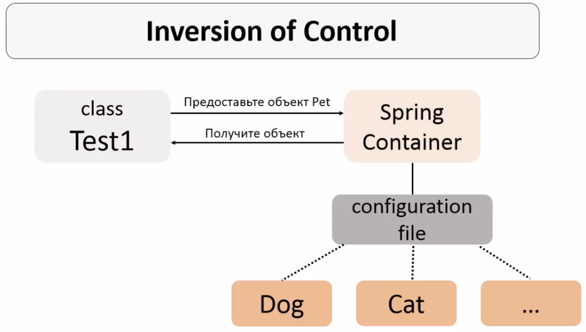

# IoC+DI

```plantext
    В данном файле собрана информация про Inversion of Control и Dependency Injection, которые исопльзуются в Spring Framework
```

- [IoC+DI](#iocdi)
  - [Inversion of Control (IoC)](#inversion-of-control-ioc)
  - [Dependency Injection (DI)](#dependency-injection-di)

## Inversion of Control (IoC)

`IoC`(инверсия управления) - это принцип проектирования, который переносит ответственность за создание и управление объектами из вызывающего кода в среду исполнения. При использовании IoC контейнер (в нашем случае Spring Container) управляет жизненным циклом объектов и определяет, какие классы должны быть созданы и когда. Таким образом, IoC - аутсорсинг создания и управления объектами, т.е. передача программистом прав на создание и управление объектами Spring-у.

Иллюстрация работы IoC

Для описания, как должен работать Spring Container можно использовать 3 способа конфигурации:

1. XML файл (устаревший подход)
2. Annotations + XML файл (современный способ)
3. Java code (современный способ)

## Dependency Injection (DI)

`Dependency Injection (DI)` — это один из способов реализации IoC. DI — это конкретный паттерн, который управляет зависимостями объекта, «вкалывая» (инжектируя) необходимые зависимости (обычно через конструктор, сеттеры или поля) вместо того, чтобы объект создавал их сам. DI - аутсорсинг добавления/внедрения зависимостей. DI делает объекты приложения слабо зависимыми друг от друга (зависимости приписываются не напрямую в коде, а в файле конфигурации).

Суть DI в том, что объект не создает свои зависимости самостоятельно, а получает их извне (например, через конструктор, метод или свойство). Это делает код более гибким, так как зависимости можно заменять другими реализациями (например, для тестирования), а также упрощает контроль над жизненным циклом объектов.

Примеры DI

- `Constructor Injection`: Зависимости передаются через конструктор объекта.
- `Setter Injection:` Зависимости передаются через сеттеры (методы установки).
- `Autowiring`: Зависимости устанавливаются напрямую в поля объекта (чаще всего используется в контексте фреймворков, которые поддерживают автоматическую инъекцию).
